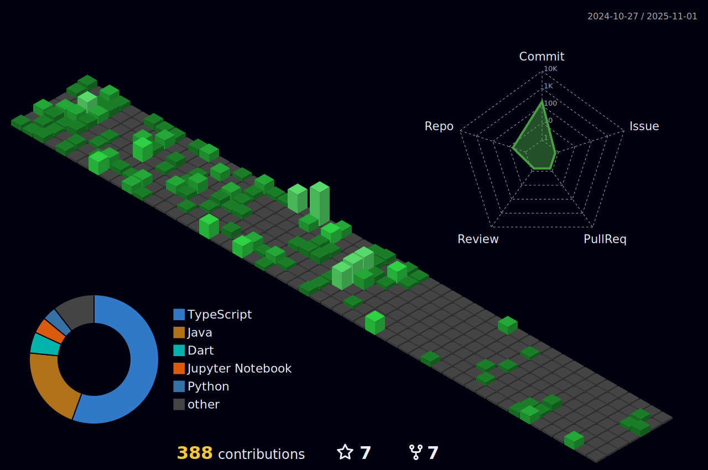

  

  

# 💫 About Me:
-🌱 I’m currently learning **MERN Stack**  -👨‍💻 All of my projects are available at [https://kris-patel.is-a.dev/](https://kris-patel.is-a.dev/)  - 💬 Ask me about **whatever you want**  - 📫 How to reach me **krishp759@gmail.com**  - ⚡ Fun fact **I think I am very innocent.**

## 🌐 Socials:

 

# 💻 Tech Stack:

# 📊 GitHub Stats:
  

